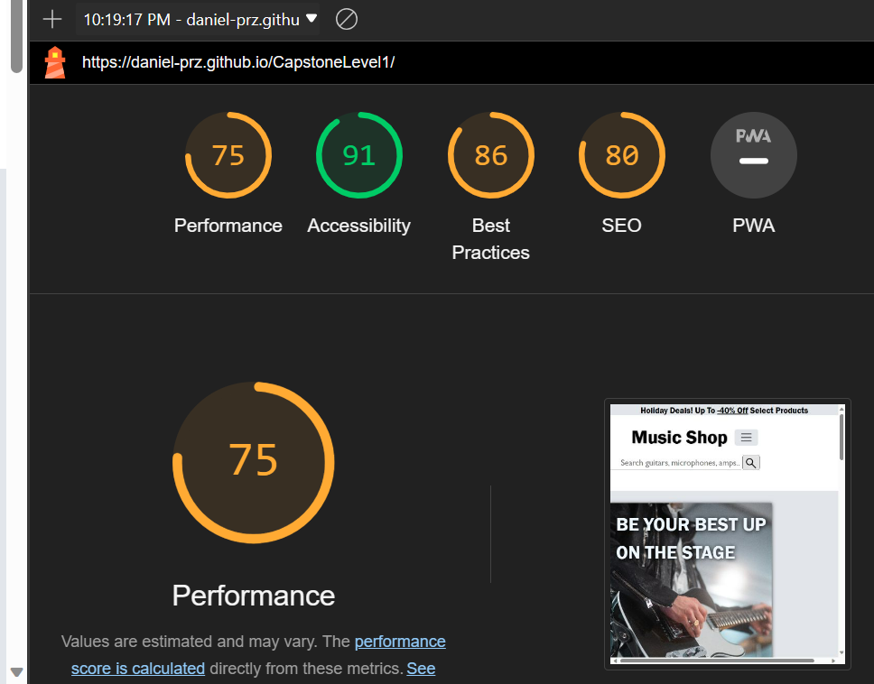
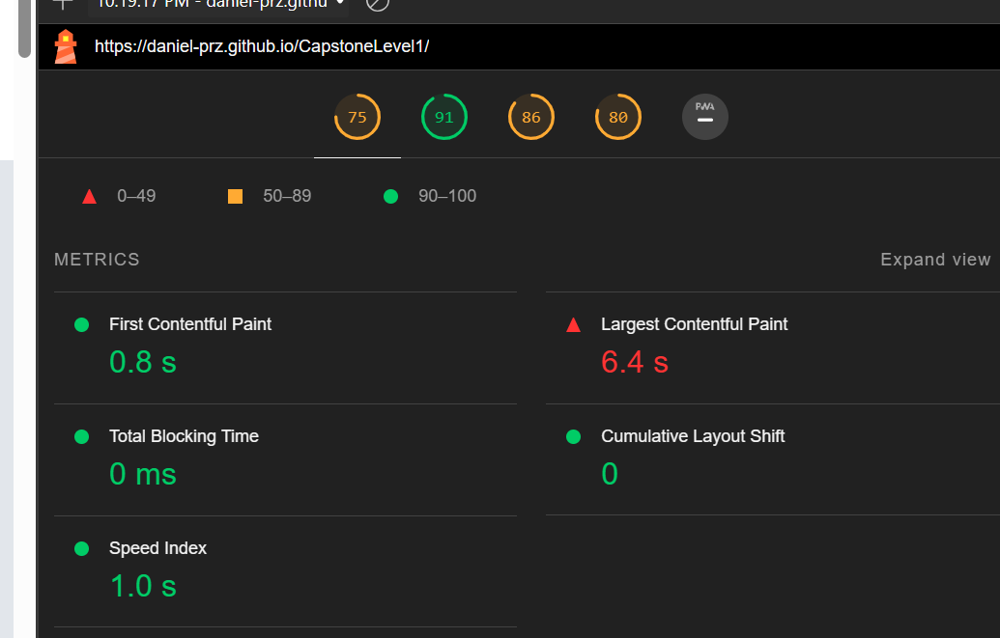
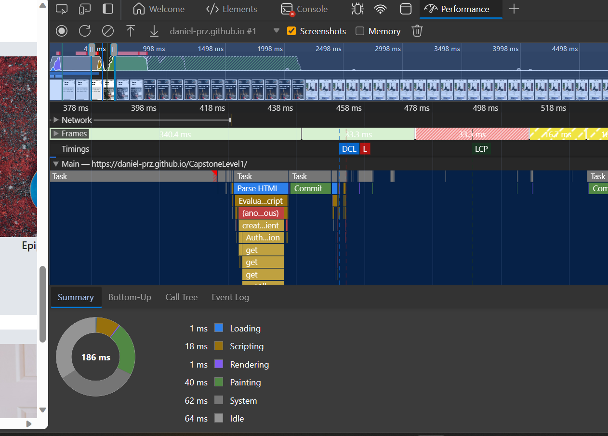
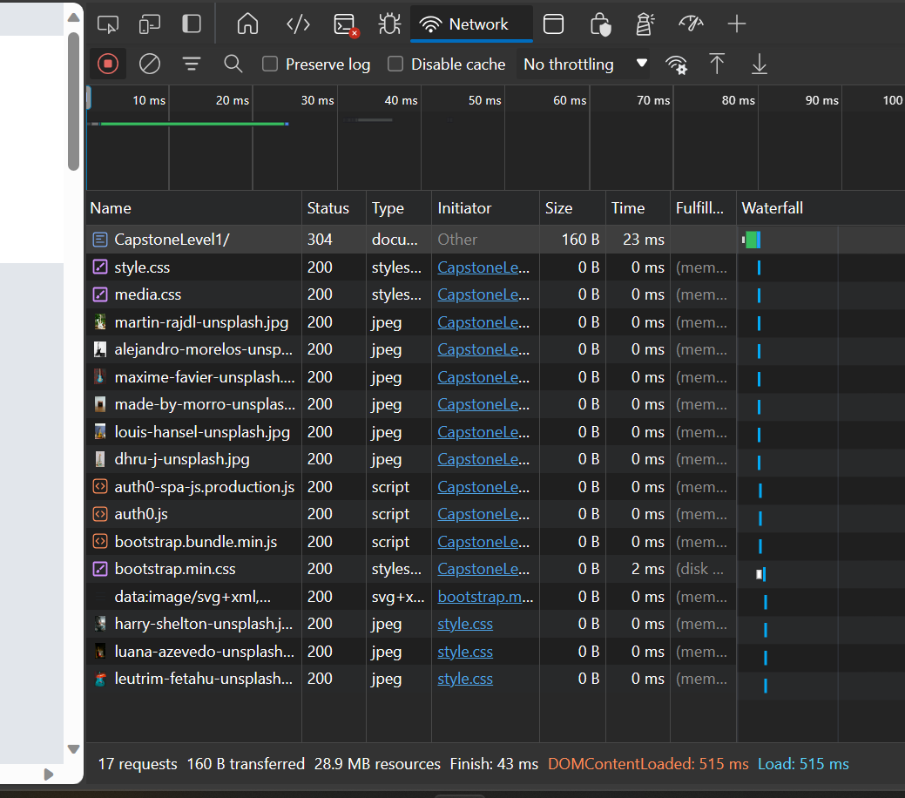

performance was under 80, at a score of 75

Suggests image resizing to accommodate mobile devices +
possible use of WebP and AVIF image formats in place of .png/.jpeg

no significant issues

no large resource causing delay

---

No major problems with site, though lighthouse performance score is below 80.

The use of performance diagnostic(lighthouse, network, performances) dev. tools
to identify issues and suggest fixes in a meaningful way seems
pretty practical.
